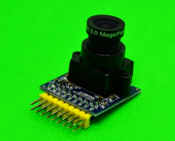

# <center>低功耗行人检测系统开发指南</center>


## 0.选型依据


## 1. 基于NUCLEO-L496ZG移植

基于keil的移植教程可以完全参考官网的步骤进行：
https://github.com/Tencent/TencentOS-tiny/blob/master/doc/10.Porting_Manual_for_KEIL.md

对stm32L496的外设引脚分配如下：


### 2.4寸LCD屏

- VCC  &rarr;  3.3v
- GND &rarr; GND
- DIN &rarr; PA7(SPI1_MOSI)
- CLK &rarr; PA5(SPI1_CLK)
-  CS &rarr; PA12
- DC &rarr; PB12
- RST &rarr; PA11
- BL &rarr; PB6(TIM_CH1)

### OV2640摄像头模块

- VCC &rarr; 3.3v
- GND &rarr; GND
- VSYNC &rarr; PB7(DCMI_VSYNC)
- HSYNC &rarr; PA4(DCMI_HSYNC)
- PCLK &rarr; PD9(DCMI_PIXCLK)
- SCL &rarr; PB4
- SDA &rarr; PB5
- RESET &rarr; PB13
- PWDN &rarr; PB15
- D0 &rarr; PC6(DCMI_D0)
- D1 &rarr; PC7(DCMI_D1)
- D2 &rarr; PC8(DCMI_D2)
- D3 &rarr; PC9(DCMI_D3)
- D4 &rarr; PE4(DCMI_D4)
- D5 &rarr; PD3(DCMI_D5)
- D6 &rarr; PE5(DCMI_D6)
- D7 &rarr; PE6(DCMI_D7)

### 板载LED

- LED_Red &rarr; PB14

### 其它外设

- 温湿度传感器
- 陀螺仪等


## 2. 2.4寸LCD驱动开发


## 3. OV2640摄像头驱动开发



### 纳秒级系统延时

需添加delay_us和delay_ms以产生摄像头配置需要的时序间隔，借助stm32底层的SysTick，具体实现在delay.c：

```c
void delay_us(uint32_t time_us) {
  uint32_t clk = 80;               // CPU 80MHz
  uint32_t ticks = time_us * clk;  // time is us
  uint32_t told = SysTick->VAL;
  uint32_t tnow = told;
  uint32_t tcnt = 0;
  for(; tcnt<ticks; tnow=SysTick->VAL)
  {
    if(tnow != told) {
      if(tnow < told) {
        tcnt += told - tnow;
      } else { 
        tcnt += SysTick->LOAD-tnow + told;
      } told = tnow;
    }
  }
}
```

### SCCB总线实现

使用PB4（SCL）和PB5(SDA)模拟软件I2C协议，向摄像头发送或接收信号，具体实现在sccb.c，其中包含以下几个函数：

```c
#define SCCB_SDA_IN()  {GPIOB->MODER&=~(3<<(5*2));GPIOB->MODER|=0<<5*2;}	//设置PB5为输入
#define SCCB_SDA_OUT() {GPIOB->MODER&=~(3<<(5*2));GPIOB->MODER|=1<<5*2;} 	//设置PB5为输出
#define SCCB_ID   			0X60  											//OV2640的ID号
void SCCB_Init(void);			//初始化GPIO
void SCCB_Start(void);			//时钟线为高时，数据线由高拉到低，为SCCB起始信号
void SCCB_Stop(void);			//时钟先为低时，数据线由低拉到高，为SCCB停止信号
void SCCB_No_Ack(void);			//产生NA信号
u8 SCCB_WR_Byte(u8 dat);		//SCCB写入一个字节
u8 SCCB_RD_Byte(void);			//SCCB读取一个字节
u8 SCCB_WR_Reg(u8 reg,u8 data);	//将一个值写入一个寄存器
u8 SCCB_RD_Reg(u8 reg);			//从一个寄存器中读出一个值
void SCCB_SCL(u8 sccb_scl);		//将时钟线设置为高或低（IO为输出模式）
void SCCB_SDA(u8 sccb_sda);		//将数据线设置为高或低（IO为输出模式）
u8 SCCB_READ_SDA(void);			//读取数据线上的值（IO为输入模式）
```

### OV2640摄像头配置

需通过配置寄存器，依次完成摄像头的初始化、RGB565模式设置、输出图像分辨率设置、图像颜色设置，具体实现在ov2640.c：

```c
void OV2640_Init(void);										//执行上电复位操作，并读取厂家ID验证
void OV2640_RGB565_Mode(void);								//设置像素格式为RGB565
void OV2640_OutSize_Set(uint16_t width,uint16_t height);	//设置输入为96*96大小的彩图
void OV2640_Special_Effects(uint8_t eft);					//eft设置为0，表示默认普通模式
```

### DCMI接口配置


## 4. 图像预处理


为完成摄像头输入彩图到模型输入需要的灰度图转换，需从输入的RGB565像素格式中解析出R、G、B三通道的值，再根据心理学公式计算出单个像素点的灰度：

```c
uint8_t RGB565toGRAY(uint16_t bg_color)	//输入RGB565像素点，返回灰度值
{
    uint8_t bg_r = 0;
    uint8_t bg_g = 0;
    uint8_t bg_b = 0;
    bg_r = ((bg_color>>11)&0xff)<<3;								//提取R通道的值
    bg_g = ((bg_color>>5)&0x3f)<<2;									//提取G通道的值
    bg_b = (bg_color&0x1f)<<2;										//提取B通道的值
    uint8_t gray = (bg_r*299 + bg_g*587 + bg_b*114 + 500) / 1000;	//心理学公式计算灰度
    return gray;
}
void Input_Convert(uint16_t* camera_buffer , uint8_t* model_buffer)	
{
	for(int i=0 ; i<OV2640_PIXEL_WIDTH*OV2640_PIXEL_HEIGHT ; i++) 	//遍历所有像素点
	{
		model_buffer[i] = RGB565toGRAY(camera_buffer[i]);			//单个像素点的RGB转换为灰度值
	}
	printf("one picture convert over\n");
}
```


## 5. Tensorflow Lite Micro移植


## 6. 行人检测demo制作

demo的实现代码放在main.cc的Task1中，并分配了10240kb的运行栈空间：

```c
void task1(void *pdata)
{
	int res = 0;	//行人检测结果判断，0为没有行人，1为有行人
    while(1)
    {
		if(frame_flag == 1)	//若中断中接收到一帧图像，标志位置1
		{
			if(HAL_DCMI_Stop(&hdcmi))	//停止图像传输
				Error_Handler();		
			Input_Convert(camBuffer , modelBuffer);	//图像预处理
			res = Person_Detect();	//调用行人检测的模型接口
			LCD_2IN4_Display(camBuffer,OV2640_PIXEL_WIDTH,OV2640_PIXEL_HEIGHT);	//lcd显示原图像
			if(HAL_DCMI_Start_DMA(&hdcmi, DCMI_MODE_CONTINUOUS,  (uint32_t)camBuffer , (OV2640_PIXEL_WIDTH*OV2640_PIXEL_HEIGHT)/2))	//开启图像传输
				Error_Handler();
			frame_flag = 0;//标志位恢复
			if(res != 0)
			{	//若检测到行人，则板载红色LED灯进行快速闪烁
				HAL_GPIO_WritePin(GPIOB, LED_Pin, GPIO_PIN_SET);
				delay_ms(50);
				HAL_GPIO_WritePin(GPIOB, LED_Pin, GPIO_PIN_RESET);
			}
		}
		osDelay(50);
    }
}
```


## 7.结果分析


